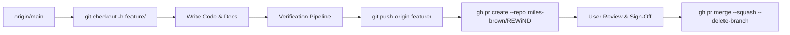

# AGENTS.md — Operational Protocol for AI Code Assistants

This document is the **highest-priority operational guideline** for AI coding assistants working in the **REWIND Evidence Atlas** codebase. Any AI agent operating in this repository MUST strictly follow these rules without exception.

---

## 1. Repository Identity & Remote Binding

- **Canonical Repository**: `https://github.com/miles-brown/REWiND.git`
- **Primary Git Remote**: `origin` (points strictly to `miles-brown/REWiND`)
- **NEVER** push, branch, or open PRs against any secondary or external repository.

---

## 2. Mandatory Branch & Pull Request Workflow

**NEVER commit or push directly to `main`.** Every bugfix, feature, data update, or documentation addition must adhere to this exact lifecycle:



### Step-by-Step Procedure

1. **Branch**:
   ```bash
   git checkout main
   git pull origin main
   git checkout -b feature/<descriptive-feature-name>
   ```

2. **Implement & Test**:
   - Write clean, strongly typed TypeScript / React 19 components.
   - Maintain documentation integrity.

3. **Mandatory Pre-PR Verification Pipeline** (all must exit with code `0`):
   ```bash
   # 1. Typecheck
   npx tsc --noEmit

   # 2. Linting (0 errors, 0 warnings)
   npm run lint

   # 3. Production Build
   npm run build:vercel

   # 4. Automated Tests
   node --test tests/ui-components.test.mjs
   ```

4. **Commit**:
   - Use conventional commit messages: `feat(timeline): ...`, `fix(slider): ...`, `docs(api): ...`.

5. **Push & Open Pull Request**:
   ```bash
   git push origin feature/<descriptive-feature-name>
   gh pr create --repo miles-brown/REWiND --base main --head feature/<descriptive-feature-name> --title "..." --body "..."
   ```

6. **Wait for User Review**:
   - Provide the PR URL and a clear walkthrough summary to the user.
   - Do **NOT** merge the PR until the user has reviewed and approved it.

---

## 3. Architecture & Data Integrity Standards

1. **Forensic Evidence Rigor**:
   - Every historical event added to `data/rewind.ts` or the database MUST have valid `sourceIds` referencing primary government/parliamentary transcripts, unedited broadcast audio/video, or contemporary news reports.
   - Never fabricate or guess dates, coordinates, or participant lists.

2. **Accessibility Standards (WCAG 2.1 AA)**:
   - Radix Slider thumbs must receive `aria-label`, `aria-valuetext`, `aria-valuenow`, `aria-valuemin`, and `aria-valuemax`.
   - All interactive controls must support keyboard navigation (`Tab`, `Space`, `Enter`, Arrow keys) with visible `:focus-visible` styling.
   - Dynamic timeline updates must announce state via `aria-live="polite"`.

3. **Viewport & UI Responsiveness**:
   - The timeline console (`PersonTimeline.tsx` / `RewindExplorer.tsx`) must remain fixed to the viewport bottom with zero-gap clamping and proper padding so content never bleeds or overlaps.

---

## 4. Repository Directory Structure

```
├── app/                      # Next.js 16 App Router (Routes & Server Pages)
├── components/
│   ├── rewind/               # Domain-specific historical atlas components
│   └── ui/                   # Reusable accessible UI primitives (Radix / Tailwind)
├── data/                     # Historical dataset models & seed registers
├── docs/                     # Comprehensive documentation suite
│   ├── architecture/         # System architecture & component boundaries
│   ├── guides/               # Getting started, keyboard shortcuts, contributing
│   ├── ACCESSIBILITY.md      # WCAG AA & ARIA contracts
│   ├── CONTRIBUTING.md       # Contribution guidelines
│   ├── DATA_SCHEMA.md        # TypeScript entity contracts
│   └── METHODOLOGY.md        # Forensic evidence tiers & verification scoring
├── lib/                      # Pure helper utilities (citations, formatting)
├── scripts/                  # Build, environment & verification shell scripts
└── tests/                    # Automated Node.js unit tests
```
