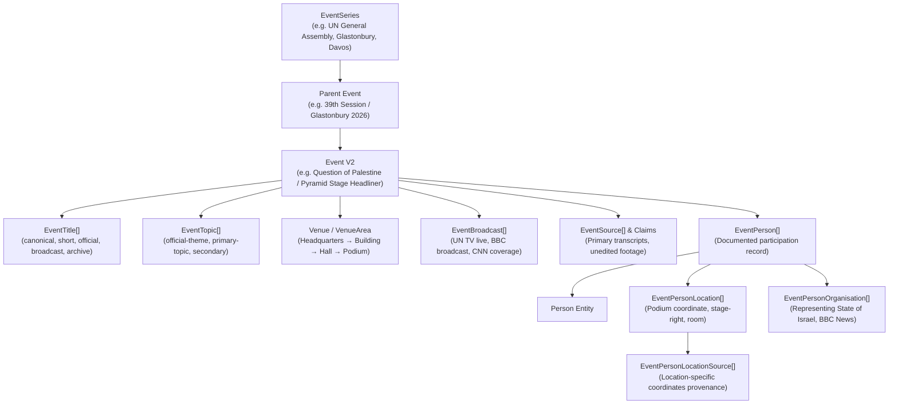

# REWiND Event Model v2 Schema Specification

## 1. Architectural Vision & Core Principles

The fundamental architectural principle of the **REWiND Evidence Atlas** is:

> **An event exists independently of any one person.**
>
> A person then has a documented relationship to that event — including **what they did, in what capacity, whom they represented, how they participated, and where within the event they were situated**.

In Event Model v1, historical events were frequently formulated around the principal subject (e.g. *"Addresses the General Assembly on the question of Palestine"*). In **Event Model v2**, the central entity answers:

> **What happened?**

rather than:

> **What did Person X do?**

### The Entity Distinction
Consider the United Nations debate on 11 December 1984:
- **Event**: `United Nations General Assembly — Question of Palestine` (`evt-1984-12-11-un-palestine`)
- **Participant 1**: Benjamin Netanyahu (`p-netanyahu`)
  - **Involvement**: Speaker
  - **Capacity**: Permanent Representative of Israel to the United Nations
  - **Representing**: State of Israel (`org-state-of-israel`)
  - **Presence Location**: Speaker's podium, General Assembly Hall
- **Participant 2**: Paul J. F. Lusaka (`p-lusaka`)
  - **Involvement**: Chair
  - **Capacity**: President of the 39th Session of the UN General Assembly
  - **Representing**: United Nations (`org-un`)
  - **Presence Location**: Presiding rostrum, General Assembly Hall
- **Participant 3**: Delegations, press, television camera operators, and translators.

Every person's individual timeline references the **same event record**. This prevents duplicate, fragmented event records (e.g. "Netanyahu addresses UN", "Delegate Y attends speech", "President chairs session") and transforms REWiND into a true **historical knowledge graph**.

---

## 2. Conceptual Entity-Relationship Architecture



---

## 3. Comprehensive Field Mapping Matrix (Model v1 → Model v2)

Every property of the legacy `EventRecord` is mapped below to its target entity, field name, action classification, and backward-compatibility behavior.

| Legacy Field (`EventRecord`) | Action | Model v2 Target Entity & Field | Migration & Transformation Logic | Fallback Behavior |
| :--- | :--- | :--- | :--- | :--- |
| `id` | **KEEP** | `EventV2.id` | Unique atomic key retained (e.g. `evt-1984-12-11-un-palestine`). | None (required). |
| `slug` | **KEEP** | `EventV2.slug` | URL-safe routing slug retained. | Derived from `canonicalTitle`. |
| `eventName` | **RENAME & NORMALIZE** | `EventV2.canonicalTitle`<br/>`EventTitle[]` | Converted from person-centric description to neutral event title. Kept on legacy adapter as deprecated alias. | Defaults to `canonicalTitle`. |
| `summary` | **KEEP** | `EventV2.summary` | Multi-sentence neutral factual summary retained. | None (required). |
| `categories` | **MOVE TO RELATIONSHIP** | `EventTopic[]`<br/>`Topic.category` | String array tags normalized into relational `EventTopic` entities. | Projected back as `string[]`. |
| `eventTypes` | **NORMALIZE** | `EventV2.eventType`<br/>`EventV2.hierarchyType` | Primary classification stored as enum; sub-types normalized. | Projected back as `string[]`. |
| `startDate` | **KEEP & ENHANCE** | `EventV2.startDate` | ISO-8601 calendar date (`YYYY-MM-DD`). | Required. |
| `endDate` | **KEEP & ENHANCE** | `EventV2.endDate` | Optional upper bound for multi-day events. | Defaults to `null`. |
| `localStartTime` | **KEEP & ENHANCE** | `EventV2.localStartTime`<br/>`EventV2.timeBasis` | 24-hour timestamp paired with evidence basis (`official`, `inferred`, etc.). | Defaults to `null`. |
| `localEndTime` | **KEEP & ENHANCE** | `EventV2.localEndTime`<br/>`EventV2.durationSeconds` | Timestamp paired with optional calculated duration in seconds. | Defaults to `null`. |
| `timezone` | **KEEP** | `EventV2.timezone` | IANA timezone string (e.g. `America/New_York`). | Defaults to venue timezone. |
| `datePrecision` | **KEEP** | `EventV2.datePrecision` | Archival resolution (`exact`, `day`, `month`, `year`, `range`). | Defaults to `"day"`. |
| `timePrecision` | **KEEP** | `EventV2.timePrecision` | Timestamp precision (`exact`, `minute`, `hour`, `approximate`). | Defaults to `"unknown"`. |
| `platform` | **MOVE TO RELATIONSHIP** | `EventV2.eventSeriesId`<br/>`EventOrganisation` | Converted to `EventSeries` reference or hosting organisation. | Projected back as `string`. |
| `venueName` | **MOVE TO RELATIONSHIP** | `Venue.name`<br/>`EventV2.venueId` | Extracted into reusable `Venue` and `VenueArea` catalog. | Projected back as `string`. |
| `address` | **MOVE TO RELATIONSHIP** | `Address`<br/>`Venue.addressId` | Structured into country-aware address components. | Formatted string projection. |
| `city` | **MOVE TO ENTITY** | `Address.city` / `Place.city` | Normalized into gazetteer place record. | Projected back as `string`. |
| `region` | **MOVE TO ENTITY** | `Address.administrativeArea` | Normalized into administrative district or state. | Projected back as `string`. |
| `country` | **MOVE TO ENTITY** | `Address.countryCode` | Normalized to ISO 3166-1 alpha-2 / alpha-3 country. | Projected back as `string`. |
| `latitude` | **SEPARATE (3-TIER)** | `EventV2.latitude`<br/>`Venue.latitude`<br/>`EventPersonLocation.latitude` | Split between event-level coordinates, venue centroid, and individual person's presence spot. | Projected back as event coordinate. |
| `longitude` | **SEPARATE (3-TIER)** | `EventV2.longitude`<br/>`Venue.longitude`<br/>`EventPersonLocation.longitude` | Split across event, venue, and person presence tiers. | Projected back as event coordinate. |
| `locationPrecision` | **EXPAND & NORMALIZE** | `EventV2.locationPrecision`<br/>`uncertaintyRadiusMetres` | Upgraded to 14-level precision hierarchy with quantitative uncertainty in metres. | Mapped to legacy 4-tier enum. |
| `participants` | **MOVE TO FIRST-CLASS** | `EventPerson[]`<br/>`EventPersonOrganisation` | Inline objects expanded into rich `EventPerson` relationships with role, capacity, and representation. | Projected back as participant list. |
| `organisations` | **MOVE TO FIRST-CLASS** | `EventOrganisation[]` | String array converted to explicit relationship table (`organiser`, `host`, `broadcaster`, `delegation`). | Projected back as `string[]`. |
| `notes` | **KEEP & SPECIALIZE** | `EventV2.researchNotes`<br/>`EventV2.internalNotes` | Separated into public evidentiary notes and internal research controls. | Projected back as `string`. |
| `scope` | **NORMALIZE** | `EventV2.accessType`<br/>`EventV2.publicEvent` | Normalized into access controls and tri-state factual indicators. | Projected back as legacy enum. |
| `medium` | **MOVE TO RELATIONSHIP** | `EventBroadcast[]`<br/>`Source.sourceType` | Coverage manifestations mapped to broadcasts and archival source classifications. | Projected back as `string[]`. |
| `confidence` | **KEEP** | `EventV2.confidence` | Record-level confidence grading (`confirmed`, `strong`, `moderate`). | Preserved directly. |
| `verificationStatus` | **KEEP** | `EventV2.verificationStatus` | Editorial status (`verified`, `provisional`, `disputed`). | Preserved directly. |
| `sourceIds` | **KEEP & ATOMIZE** | `EventSource[]`<br/>`Claim.sourceId` | Associated at event level and down to individual claims. | Array of source IDs preserved. |
| `quotes` | **MOVE TO FIRST-CLASS** | `Quote[]` | Verbatim quotations with speaker, media timestamp, and language. | Preserved directly. |
| `media` | **MOVE TO FIRST-CLASS** | `MediaAsset[]` | Archival media assets with type, duration, and thumbnail. | Preserved directly. |
| `provenance` | **MOVE TO AUDIT** | `audit_log` / `Claim` excerpt | Archival audit trail preserved in forensic change logs. | Projected back as `string[]`. |
| `conflictingClaims` | **MOVE TO CLAIM GRAPH** | `Claim` (status: disputed) | Conflicting historical accounts modeled via atomic claims. | Projected back as `string[]`. |
| `reviewedAt` | **KEEP** | `EventV2.reviewedAt` | ISO-8601 editorial review timestamp. | Preserved directly. |

---

## 4. The Three-Tier Geospatial Model

A common architectural flaw in historical databases is conflating the venue coordinates with the person's coordinates. In Event Model v2, geography is explicitly modeled across three tiers:

```text
┌─────────────────────────────────────────────────────────────┐
│ 1. Event Location (Centroid of broad site / complex)        │
│    e.g. United Nations Headquarters (40.7489° N, 73.9680° W)│
├─────────────────────────────────────────────────────────────┤
│ 2. Venue Area (Specific building, hall, or compound)        │
│    e.g. General Assembly Hall (Building precision)          │
├─────────────────────────────────────────────────────────────┤
│ 3. Person Presence Location (Exact documented spot)         │
│    e.g. Speaker's Podium, Rostrum (Exact-position precision)│
└─────────────────────────────────────────────────────────────┘
```

### The Golden Geospatial Rule
> **Never claim greater geographic precision than the primary evidence supports.**
> If footage or transcripts only confirm that an individual was at United Nations Headquarters, the system records `building` precision (50m uncertainty), rather than fabricating an exact coordinate at a podium.

### Multi-Location & Itinerary Movements
For events that inherently move (e.g. presidential motorcades, marches, funeral processions, flights aboard Air Force One), `locationType` is set to `"route"` or `"multi-location"`, supported by `EventLocationSequence`:
1. Departure point
2. Waypoints / checkpoints
3. Final destination

---

## 5. Country-Aware Address & Descriptive Location Modeling

Addresses must respect the native formatting of each sovereign jurisdiction rather than forcing a rigid Western structure.

```typescript
export interface Address {
  id: string;
  countryCode: string;               // ISO 3166-1 alpha-2 (e.g. "GB", "US", "IL", "JP")
  buildingName?: string;
  subBuilding?: string;
  streetNumber?: string;
  streetName?: string;
  neighbourhood?: string;
  locality?: string;
  city?: string;
  administrativeArea?: string;       // State, Province, County, Prefecture
  postalCode?: string;
  formattedLocal: string;            // Authoritative address formatted per national convention
  formattedEnglish?: string;         // Standardized English representation
  descriptiveLocation?: string;      // E.g. "Second floor private conference room"
  latitude?: number;
  longitude?: number;
}
```

---

## 6. Factual Indicators & Research Controls

### Tri-State Factual Indicators (`"yes" | "no" | "unknown"`)
Historical documentation often lacks evidence of negative assertions. A boolean `isTelevised = false` falsely implies definitive proof that no broadcast took place. Therefore, public factual indicators utilize a strict tri-state model:

```typescript
export type TriState = "yes" | "no" | "unknown";

export interface EventFactualFlags {
  physicalAttendanceConfirmed: TriState;
  remoteParticipation: TriState;
  publicEvent: TriState;
  openToPress: TriState;
  ticketed: TriState;
  invitationOnly: TriState;
  televised: TriState;
  broadcastLive: TriState;
  streamedOnline: TriState;
  audioRecorded: TriState;
  videoRecorded: TriState;
  photographed: TriState;
  transcriptAvailable: TriState;
  fullRecordingKnown: TriState;
  exactStartTimeKnown: boolean;
  exactEndTimeKnown: boolean;
  exactVenueKnown: boolean;
  exactRoomKnown: boolean;
  personPreciseLocationKnown: boolean;
  organiserIdentified: boolean;
  attendanceListKnown: TriState;
  officialProgrammeAvailable: TriState;
  eventCancelled: boolean;
  eventPostponed: boolean;
  occurredAsScheduled: TriState;
}
```

### Internal Editorial & Review Flags
Internal workflow controls isolate research management from public output:
- `needsReview`: Editorial approval pending.
- `needsGeocodeReview`: Coordinates require human GIS validation.
- `possibleDuplicate`: Automated fingerprint similarity flagged.
- `likelyPartOfLargerEvent`: Hierarchy resolution needed.
- `primarySourcePresent`: At least one Tier-A primary source attached.
- `conflictingSources`: Evidence sources disagree on dates or details.
- `sensitiveLocation`: Exact point suppressed from public map view.
- `dataCompletenessScore`: Quantitative metric (0–100) based on verified fields.

---

## 7. Migration Plan & Backward Compatibility

1. **Dual-Read Compatibility Layer**:
   - `lib/adapters/event-v2-adapter.ts` provides zero-downtime projection between legacy `EventRecord` and `EventV2`.
   - All existing front-end pages (`/person/[slug]`, `/event/[slug]`, `/sources`, `/compare`) continue functioning without breaking changes.
2. **Neutral Title Transition**:
   - The 206 seed records in `data/rewind.ts` are upgraded incrementally.
   - `canonicalTitle` is populated with neutral descriptive names, while legacy `eventName` is maintained as a fallback.
3. **Database Schema Harmonization**:
   - `db/schema-v2.ts` introduces normalized relational tables for Postgres/Supabase without destroying legacy table structures.
