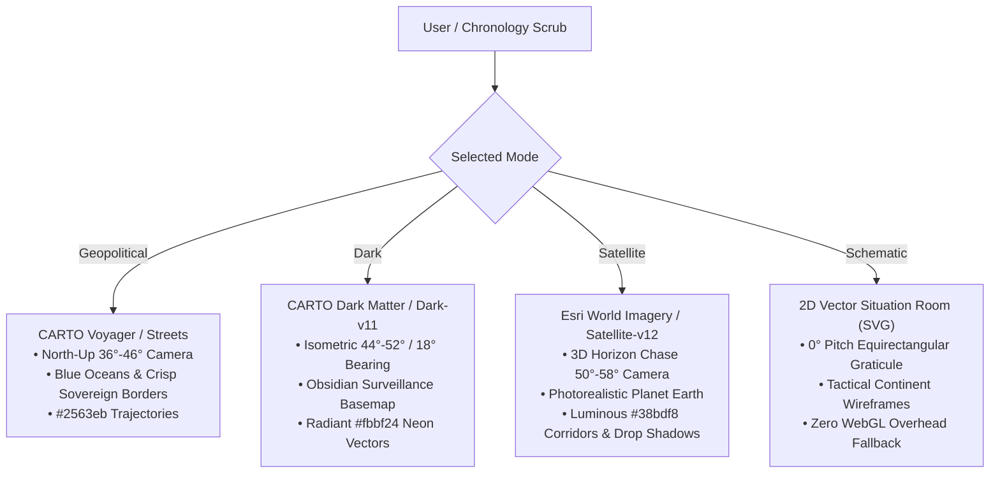
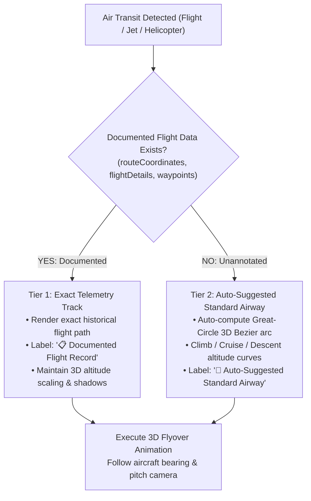

# GEOSPATIAL & MAP MODES SPECIFICATION

This document outlines the architectural definitions, visual styles, camera behaviors, and evidentiary precedence rules governing all geospatial visualization in the **REWIND Evidence Atlas**.

---

## 1. Map View Definitions & Visual Performance Profiles

The atlas provides 4 specialized map views, each engineered for a distinct analytical purpose and optimized with dedicated camera perspectives, raster fallbacks, and rendering behaviors:

---

### Comparative Mode Matrix

| Mode | Basemap Style / Source | Visual Characteristics | Camera Pitch & Bearing | Trajectory & Marker Visuals |
| :--- | :--- | :--- | :--- | :--- |
| **Geopolitical** *(Default)* | CARTO Voyager / Mapbox Streets | Natural blue oceans, physical terrain relief, crisp sovereign borders, capital/city labels | `pitch: 36°` (ground) / `46°` (air) `bearing: 0°` (North-Up) | Blue `#2563eb` paths, cyan `#38bdf8` active route, high-contrast borders |
| **Dark Forensic** | CARTO Dark Matter / Mapbox Dark-v11 | Obsidian stealth basemap, high contrast, low-light situational monitoring | `pitch: 44°` (ground) / `52°` (air) `bearing: 18°` (Isometric) | Golden amber `#fbbf24` historical paths, glowing neon active vectors |
| **Satellite** | Esri World Imagery / Mapbox Satellite-v12 | High-resolution cloudless photorealistic satellite imagery, terrain topography | `pitch: 50°` (ground) / `58°` (air) `bearing: heading + 18°` (3D Chase) | Luminous cyan `#38bdf8` 3D airway corridors, dynamic altitude drop shadows |
| **Schematic** | SVG Tactical Blueprint Canvas | Tactical situation room wireframe, world continent landmasses, latitude/longitude graticules | `pitch: 0°` Equirectangular 2D projection | Pulsing glowing SVG Bezier curves, tactical teardrop pins, zero GPU load |

---

## 2. Flight Corridor & Transit Routing Hierarchy

To ensure seamless forensic exploration without requiring tedious manual data entry, the system implements an **Automated Two-Tier Precedence Hierarchy**:

### Precedence Rules

1. **Tier 1: Documented Real Flight Data (Highest Precedence)**:
   - If an event contains explicit ADS-B flight plots, FlightRadar24 logs, manifest waypoints (`currEvent.flightDetails.routeCoordinates` or `currEvent.routeCoordinates` or `currEvent.waypoints`), the system **strictly overrides** any synthetic route and renders the exact historical path.
   - The UI displays `📋 Documented Flight Record` and records the aircraft model/tail registration.

2. **Tier 2: Zero-Config Auto-Suggested Airway Corridors (Default)**:
   - When no granular route coordinates are provided, the system **automatically computes the realistic Great-Circle airway corridor** between origin and destination coordinates.
   - The route is elevated into a 3D parabolic Bezier altitude profile:
     - Commercial & Private Jets: Climbs to $\approx 10,500\text{ m}$ cruise altitude with positive climb pitch ($+5^\circ$ to $+15^\circ$) and negative descent pitch ($-5^\circ$ to $-15^\circ$).
     - Helicopters: Ceiling clamped to $\le 1,500\text{ m}$.
   - The UI automatically displays `🧭 Auto-Suggested Standard Airway`.

---

## 3. Ground, Maritime, and Rail Network Routing

For non-aerial transit (`car`, `bus`, `train`, `boat`, `ship`, `motorcade`), straight-line interpolation is strictly prohibited:

1. **Routing Engines**:
   - Queries the **Mapbox Directions API** (`mapbox/driving`, `mapbox/walking`) when available.
   - Falls back to the **OSRM Public Routing API** (`router.project-osrm.org`) for open-source road network resolution.
   - In offline or rate-limited environments, generates a **dynamic multi-point curved spline** with lateral geographic deflection.
2. **Progressive Path Animation**:
   - Renders a translucent background route guide layer (`active-leg-planned`).
   - Progressively draws a solid network path (`active-leg-route`) synchronized with the vehicle marker's real-time position.

---

## 4. Error Resilience & Independent Raster Fallbacks

To prevent theme switching from unexpectedly reverting Dark or Satellite modes to light maps, every theme maintains an independent, direct raster tile source:
- **Satellite**: `https://server.arcgisonline.com/ArcGIS/rest/services/World_Imagery/MapServer/tile/{z}/{y}/{x}`
- **Dark Matter**: `https://[a-d].basemaps.cartocdn.com/dark_all/{z}/{x}/{y}@2x.png`
- **Geopolitical**: `https://[a-d].basemaps.cartocdn.com/rastertiles/voyager/{z}/{x}/{y}@2x.png`

Any remote vector style or glyph error is caught in isolated fallback handlers without mutating the user's active theme selection.
